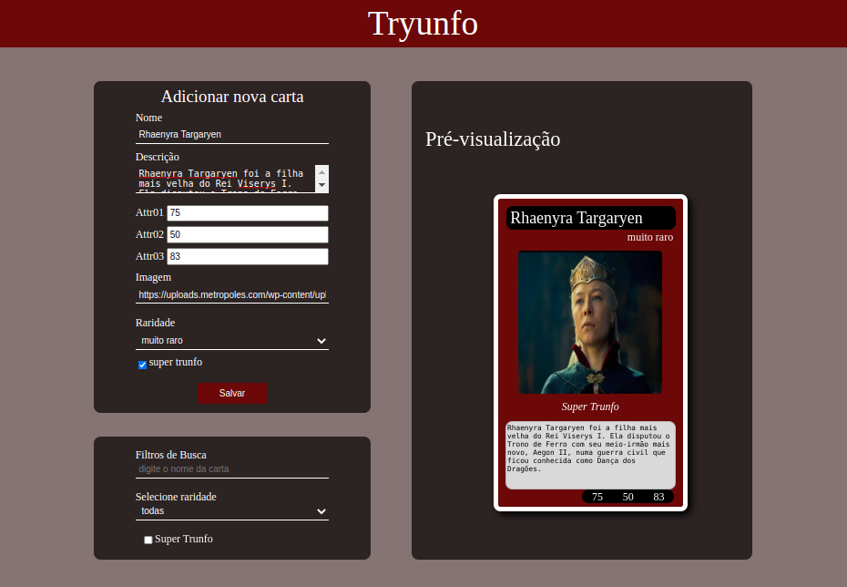

<h1>Projeto Tryunfo</h1>

 Este projeto consiste em um criador de cartas do jogo SuperTrunfo. Voce podera ver sua carta em uma pre-visualizaçao durante a construçao, e tambem ver as cartas ja existentes em seu baralho, sempre respeitando as regras do jogo. Voce tambem podera filtrar as cartas de seu baralho para encontrar com mais facilidade.

 O projeto foi criado dentro da escola de formação beTrybe, a fim de praticar a avaliar os conhecimentos aprendidos sobre Formularios, e estados de componentes.

 

<h1>Tecnologias utilizadas:</h1>
<ul>
  <li>JavaScript</li>
  <li>HTML</li>
  <li>CSS</li>
  <li>React</li>
</ul>

<h1>Como rodar o projeto:</h1>

Para que o projeto possa rodar em sua maquina, sera necessario ter instalado o <a href="https://nodejs.org/en/" target="_blank" >node</a>, e o gerenciador de pacotes <a href="https://docs.npmjs.com/downloading-and-installing-node-js-and-npm" target="_blank" >NPM(node package manager)</a>. Apos todas as dependencias do projeto serem instaladas, basta abrir o terminal dentro da pasta do projeto, rodar o comando 'npm install' para que todas as dependencias sejam instaladas, e em seguida abrir o projeto com o comando 'npm install'

Para uma melhor visualizaçao do app, um pequeno acervo de cartas ja esta sendo renderizado no baralho. Para retirar essas cartas basta entrar dentro de App.js e dentro do state na chave cards substiruir "game_of_Cards" por um array vazio.

